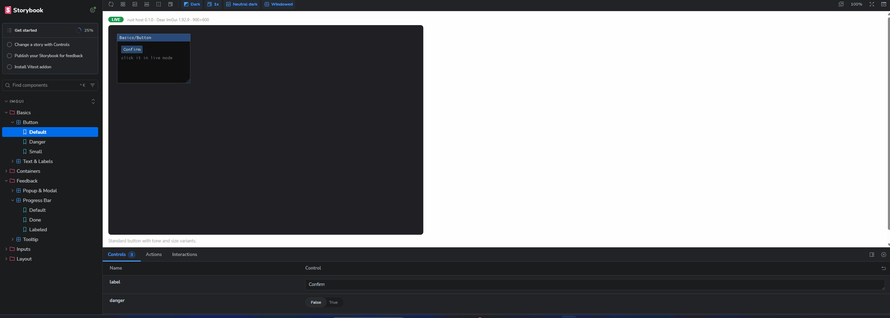

# imgui-storybook

A [Storybook](https://storybook.js.org) for [Dear ImGui](https://github.com/ocornut/imgui) — document, browse and interact with ImGui components in a real browser, rendered by the **real ImGui**.

Storybook's story workflow (sidebar, Controls, docs, static export) applied to immediate-mode GUIs. Stories run as real code on a language-specific **host** that renders Dear ImGui offscreen and streams frames to the Storybook preview; a static export of PNG captures plus structured docs makes every component readable by humans **and AI models** without running anything.



```
┌─────────────────────────┐   WebSocket (JSON + JPEG frames)   ┌──────────────────────────────┐
│  Storybook web app      │ ◄──────────────────────────────►   │  host: java (default) | rust │
│  sidebar · Controls ·   │   select / setArgs / setView       │  hidden window + exact FBO   │
│  docs · canvas          │   input (mouse/keys) ──────────►   │  java: imgui-java 1.92.7     │
│                         │   ◄────────── frames / actions     │  rust: easy-imgui 1.92.9b    │
│  offline: PNG captures  │                                    │  real fonts, style, backends │
└─────────────────────────┘                                    └──────────────────────────────┘
```

## Why it looks exactly like your app

Dear ImGui is immediate mode: the same widget calls your product makes every frame are the only thing that can render it faithfully. The java host runs `io.github.spair:imgui-java:1.92.7.1` with the standard LWJGL GLFW/OpenGL3 backends — the stack any pure-Java Dear ImGui app sits on, whether it draws over OpenGL, Vulkan or an engine layer: desktop tools, editors, game UIs, in-game overlays, Minecraft mods. The rust host does the same on [easy-imgui](https://crates.io/crates/easy-imgui) (upstream `1.92.9b`). Pick whichever host matches your product; captures and live frames are pixel-faithful by construction, not by imitation.

To document **your** product's look, implement a `StoryTheme` (Java) / the fonts+style hook (`rust-host/src/imgui_host.rs`, using `style.FontScaleMain`), load the same TTFs and colors as your app, and register your stories — see below.

## Repository layout

| Path | What it is |
| --- | --- |
| `java-host/api` | Story API for authors: `Story`, `ArgSet`, `StoryContext`, `StoryTheme`, `StoryRegistry`. Zero dependencies beyond the imgui binding. |
| `java-host/host` | The Java host: offscreen renderer, `--list` catalog, `--capture` PNG export, `--serve` WebSocket live mode, 16 built-in demo stories. |
| `rust-host` | The Rust host — same CLI, same wire protocol, same 16 demo stories, on `easy-imgui` (Dear ImGui 1.92.9b). |
| `packages/protocol` | TypeScript types for the host wire protocol. |
| `packages/client` | Preview runtime: live canvas + input forwarding, with automatic static-PNG fallback. |
| `app` | The Storybook app (`@storybook/html-vite`) + toolbar globals (theme, scale, backdrop, canvas mode). |
| `scripts` | Orchestration: `gen-stories.mjs`, `capture.mjs`, `dev.mjs`, `build-site.mjs`. |

## Quick start (Windows, JDK 25+ and/or Rust toolchain, Node 20+)

Java host needs a JDK 25; rust host needs a current Rust toolchain (`rustup`) and **libclang** for bindgen (`winget install LLVM.LLVM` — `rust-host/.cargo/config.toml` points `LIBCLANG_PATH` at the default install location).

```bash
npm install

# interactive: java host (ws://localhost:8765) + storybook dev server
npm run dev            # open http://localhost:6006 — pill shows LIVE

# same thing on the rust host
npm run dev -- --host rust

# static site with captures + AI docs (dist-site/)
npm run build:site
```

`npm run dev` builds the chosen host on first run (Gradle wrapper for java, `cargo build --release` for rust). Every script accepts `--host java|rust`; `IMGUI_HOST=rust` works too.

On the rust host, the dev watcher watches `rust-host/src` (and `Cargo.toml`): saving a file rebuilds and restarts the host automatically — the storybook preview reconnects on its own. `IMGUI_NO_STORYBOOK=1` runs the host alone (handy with `cargo test` in a second terminal).

## Rust host

`rust-host/` is a second implementation of the same host contract in Rust: identical CLI (`--list/--serve/--capture`), identical WebSocket protocol (`hello.host: "rust"`), identical story catalog shape, captures and `captures.json`. Stories implement a `Story` trait (`rust-host/src/api.rs`) mirroring the Java API; the 16 demo stories are ported 1:1.

Differences from the Java host, by design:

- Binding: [easy-imgui](https://crates.io/crates/easy-imgui) 0.24, tracking upstream Dear ImGui **1.92.9b** (vs 1.92.7 on imgui-java) — the protocol field stays `imguiJavaVersion` so the TS layer never branches per host.
- Fonts: Dear ImGui 1.92's dynamic font system (`style.FontScaleMain`) replaces the Java atlas-rebuild-on-scale-change.
- Window/context: hidden winit window + glutin (WGL) + glow — no GLFW, no CMake; the Dear ImGui C++ is compiled by the `cc` crate and bound with bindgen, which needs **libclang** (`winget install LLVM.LLVM`; `rust-host/.cargo/config.toml` sets `LIBCLANG_PATH` to the default install path).

```bash
cd rust-host
cargo test                 # unit tests (catalog shape, protocol, coercion, keymap...)
cargo run -- --list --json
cargo run --example spike  # renders a story offscreen to target/spike.png
```

## Writing stories (Java)

Implement `Story`, declare typed args (they become Storybook Controls automatically), and register via `META-INF/services/com.lattestudio.imguistorybook.api.Story` or programmatically:

```java
public final class StatusChipStory implements Story {
    public String title() { return "Widgets/Status Chip"; }   // '/' = sidebar groups
    public String description() { return "Chip with tone per status enum."; }

    public void defineArgs(ArgSet args) {
        args.string("label", "Em andamento")
            .enumOf("status", Status.class, Status.PROGRESS)
            .preset("compacto", "label", "Ok");
    }

    public void render(StoryContext ctx) {
        // draw with ImGui.* exactly as in your product
        chip(ctx.enumValue("status", Status.class), ctx.string("label"));
        if (button("confirm")) ctx.action("clicked");   // shows as a toast + WS event
    }
}
```

Run the host with your stories on the classpath:

```bash
java -cp "your-mod-classpath;imgui-storybook-host/*" com.lattestudio.imguistorybook.host.HostMain --serve
npm run dev   # storybook picks it up on ws://localhost:8765
```

Regenerate the CSF bridge after adding stories: `npm run gen`.

## Writing stories (Rust)

The rust host speaks the same concepts: implement the `Story` trait, declare typed args, and register on a `StoryRegistry`. `rust-host/src/demo/` has all 16 ported stories as reference.

```rust
use imgui_storybook_rust_host::api::{ArgSet, ArgValue, Story};
use imgui_storybook_rust_host::ctx::{StoryCtx, StoryUi};
use imgui_storybook_rust_host::easy_imgui::lbl;

pub struct StatusChipStory;

impl Story for StatusChipStory {
    fn title(&self) -> &str { "Widgets/Status Chip" }   // '/' = sidebar groups

    fn description(&self) -> &str { "Chip with tone per status enum." }

    fn define_args(&self, args: &mut ArgSet) {
        args.string("label", "Em andamento")
            .enum_of("status", &["Open", "Progress", "Done"], "Progress")
            .preset("compacto", [("label", ArgValue::from("Ok"))]);
    }

    fn render(&mut self, ui: &StoryUi, ctx: &mut StoryCtx) {
        // draw with the easy-imgui Ui, exactly as in your product
        chip(ui, &ctx.enum_str("status"), &ctx.string("label"));
        if ui.button(lbl("confirm")) {
            ctx.action("clicked");   // shows as a toast + WS event
        }
    }
}
```

Unlike the Java `ServiceLoader` discovery, registration is in code: `rust-host/src/main.rs` calls `demo::register_all(&mut registry)` for the built-in stories — to document your own product, depend on the crate (`imgui-storybook-rust-host`), build your `StoryRegistry` and call `serve::run(&cli, &mut registry)` from your own binary. Then point the tooling at it:

```bash
npm run dev -- --host rust
```

## Commands (both hosts — same CLI)

```
host --list --json                                 # story catalog (drives the TS generator)
host --serve [--port 8765] [--width 900] [--height 600] [--no-demo]
host --capture [--out DIR] [--themes light,dark] [--scales 1,2]
```

## Static export (for humans and AI models)

`npm run build:site` produces `dist-site/`:

- `index.html` — the full Storybook UI; every preview falls back to the real captured PNG when no host is running (pill shows `OFFLINE`).
- `STORIES.md` — one consolidated document: every story with description, arg table, presets and inline screenshots (relative links). Feed this to an AI model — no browser required.
- `manifest.json` — the same content as structured data: arg schemas with types/defaults, preset definitions, capture file lists, host/imgui versions.
- `captures/` — PNGs rendered by the real Dear ImGui (per story × preset × theme × scale).

## Fidelity notes

- Version pinning is part of the contract: keep `imguiJavaVersion` in `java-host/gradle.properties` equal to the imgui-java version your product ships with (the `+imgui.x.y.z` suffix in `fabric-gui-imgui` versions tells you which). On the rust host, keep `BINDING_VERSION` in `rust-host/src/info.rs` in sync with the `easy-imgui` dependency.
- The offscreen renderer uses an exact-size FBO (hidden windows report a 0×0 framebuffer on Windows) with `DisplayFramebufferScale` forced to 1 — output is deterministic across machines and DPI settings.
- If your product draws ImGui through its own rendering stack instead of the platform GL backends (a Minecraft mod rendering via Blaze3D, an engine-integrated Vulkan renderer, …), captures reflect the host's GLFW/OpenGL path and may differ slightly from the in-game image. Document the delta in the story description where it matters.

## License

MIT © Paique. Built on [Storybook](https://github.com/storybookjs/storybook) (MIT), [imgui-java](https://github.com/SpaiR/imgui-java) (MIT), [easy-imgui](https://github.com/rodrigorc/easy-imgui-rs) (MIT), [Dear ImGui](https://github.com/ocornut/imgui) (MIT), [LWJGL](https://www.lwjgl.org) (BSD).
